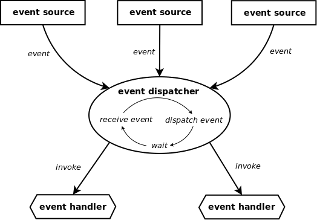
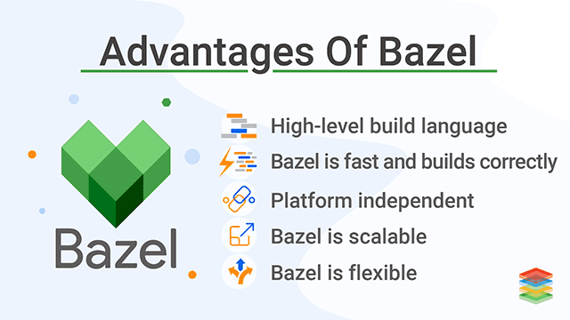

# Many as One

Cloud native Superclusters supercomputed neural network parallel(core/threads, TBB, vectorized instructions), heterogeneous(FPGA or GPU accelations) computed.

There's a lot of NN framework for parallel, heterogeneous computed on distributed computing. but this frameworks needed specific machine that vecdor dependent software. futher more, user frontend should be able to utilize a high-performance NN backend in a convenient web-based interface on any playform.

Also, we need container, k8s friendly cloud native framework.

# Webapp - Frontend

 

    

 

Web application visualize your model graph and provide interface that communicate with neural network handle each layer or unit. system monitoring each computing nodes that have unit are also planned.

# Neural Network - Backend

Scale out nerual network on cloud or on premise cluster based computing. loadbalance your trainning / test processes from big data input. so, this will reduce the NN's learning time. we can make decision agilely from insight we want by quickly being responsed from NN.

## SYCL based tensor programming by Eigen
  

We don't need on tensor programming on `CUDA` with bunch of codes in `.cuh`.
we need type safe programming. so, no more `.cl` codes from `OpenCL`.
 
 

    We must break free from lock-in to specific GPU vendors. High-performance and energy efficient machines can coexist and cooperative each other in distributed neural network.

 

 

Thus, we select `Eigen` tensor that have implemented SYCL backend for heterogeneous computing.
 

 

    

 

## Handle datas with `Colomnar DB` format

We need superfast, GPU accelated, and size optimized standard colmnar format.
 
 
 

---

## boost::asio based `async event driven`

    

We can maximize network communication performance in distributed neural network by using boost::beast framework based boost::asio async event driven programming.

# Distributed build system

    

To deal with future large distributed compile, use bazel fast build and unit test.

# Reference

## Frontend

- [3d-force-graph](https://github.com/vasturiano/3d-force-graph)
- [visualizing-graphs-in-3d-with-webgl](https://neo4j.com/developer-blog/visualizing-graphs-in-3d-with-webgl/)

## Backend

- [oneTBB](https://github.com/oneapi-src/oneTBB)
- [SYCL](https://en.wikipedia.org/wiki/SYCL)
- [크로노스 그룹 SYCL 2020 표준 발표](https://kr.khronos.org/news/press/sycl-2020)
- [Apache Arrow](https://en.wikipedia.org/wiki/Apache_Arrow)
- [Eigen](https://en.wikipedia.org/wiki/Eigen_(C%2B%2B_library))
- [boost C++ Libraries](https://www.boost.org/)
- [Bazel](https://en.wikipedia.org/wiki/Bazel_(software))
