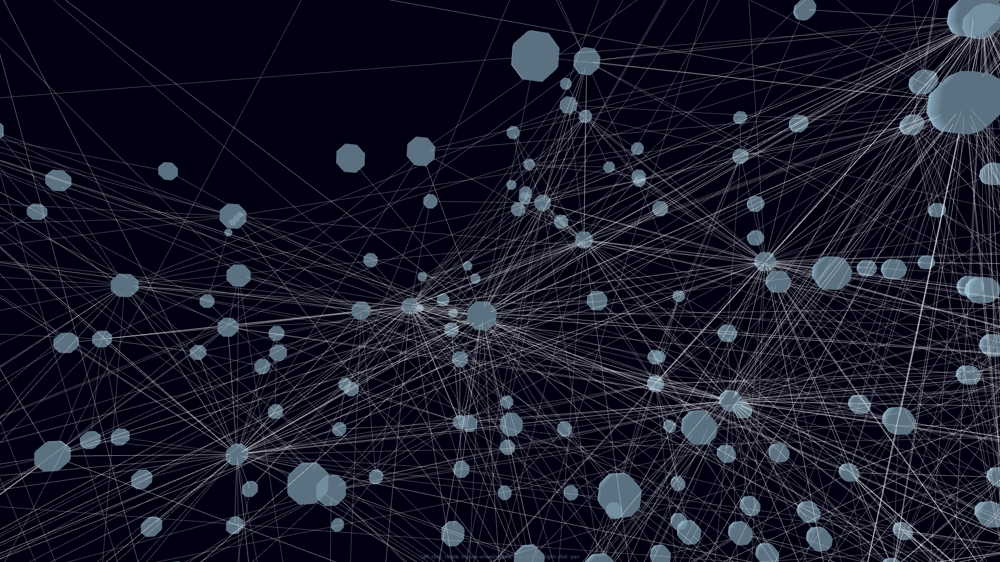
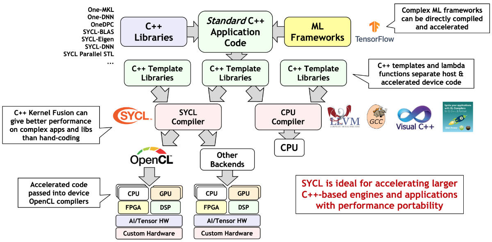

# Many as One

Cloud native Superclusters supercomputed neural network parallel(core/threads, TBB, vectorized instructions), heterogeneous(FPGA or GPU accelations) computed.

There's a lot of NN framework for parallel, heterogeneous computed on distributed computing. but this frameworks needed specific machine that vecdor dependent software. otherwise, we need to provide an environment where low-performance machines and high-performance machines can coexist and cooperative each other in distributed neural network. futher more, user frontend should be able to utilize a high-performance backend in a convenient web-based interface on any playform.

Also, we need container, k8s friendly cloud native framework.

## Webapp - Frontend

    

Web application visualize your model graph and provide interface that communicate with neural network handle each layer or unit. system monitoring each computing nodes that have unit are also planned.

## Neural Network - Backend

Scale out nerual network. loadbalance your trainning / test input big datas, this will reduce the NN's learning time.

### Tensor programming

We don't need `CUDA` and no more `.cl` codes for type safe.
 
 

---

We must break free from lock-in to specific vendors.
 
 

---

Thus, we select `Eigen` tensor that have implemented SYCL backend.
 
 

---

    

---

## Handle datas with `Colomnar DB` format

We need superfast, GPU accelated size optimized colmnar Format.
 
 
 

---

## boost::asio based `event driven network`

We can maximize network communication performance using boost::asio event driven programming model in distributed neural network.

---
## Distributed build system

    To deal with future large distributed compile, use bazel fast build and unit test.

 
 
 
 
 
 
---

## Reference

### Frontend

- [neo4j-3d-force-graph](https://github.com/jexp/neo4j-3d-force-graph)
- [visualizing-graphs-in-3d-with-webgl](https://neo4j.com/developer-blog/visualizing-graphs-in-3d-with-webgl/)

---
### Backend

- [oneTBB](https://github.com/oneapi-src/oneTBB)
- [SYCL](https://en.wikipedia.org/wiki/SYCL)
- [Apache Arrow](https://en.wikipedia.org/wiki/Apache_Arrow)
- [Eigen](https://en.wikipedia.org/wiki/Eigen_(C%2B%2B_library))
- [boost C++ Libraries](https://www.boost.org/)
- [Bazel](https://en.wikipedia.org/wiki/Bazel_(software))
